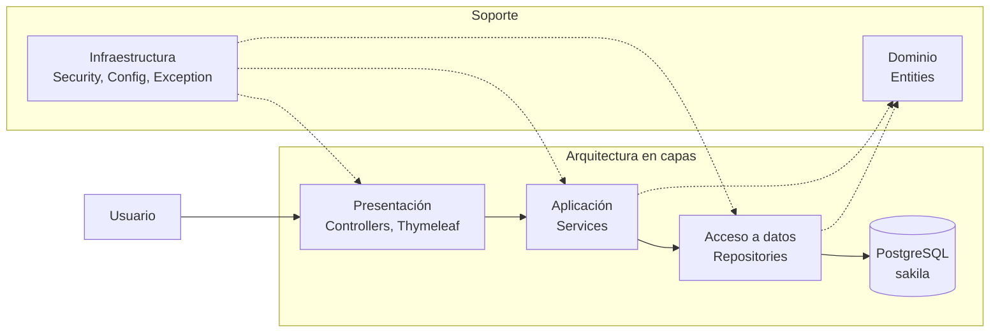

# Índice

- [1. Resumen](#1-resumen)
- [2. Tecnologías Utilizadas](#2-tecnologías-utilizadas)
- [3. Arquitectura](#3-arquitectura)
- [4. Rutas Protegidas](#4-rutas-protegidas)
- [5. Autenticación y Seguridad](#5-autenticación-y-seguridad)
- [6. Pool de Conexiones](#6-pool-de-conexiones)
- [7. Índices de Base de Datos](#7-índices-de-base-de-datos)
- [8. Instalación](#8-instalación)
- [9. Documentación de la API](#9-documentación-de-la-api)
- [10. Endpoints de la API](#10-endpoints-de-la-api)

---

# 1. Resumen

SakilaRental es un proyecto Spring Boot MVC para el flujo de la tienda de alquiler de DVD Sakila — catálogo de películas, gestión de inventario, alquileres y devoluciones de clientes, CRUD administrativo, autenticación JWT, control de sesión única y persistencia PostgreSQL con pool de conexiones HikariCP.

# 2. Tecnologías Utilizadas

| Tecnología                          | Versión    |
| ----------------------------------- | ---------- |
| Java (JDK)                          | 17.0.12    |
| Spring Boot                         | 4.1.0      |
| Spring Boot Web, JPA, Security      | 4.1.0      |
| SpringDoc OpenAPI (Swagger)         | 2.8.5      |
| JSON Web Token (jjwt)               | 0.12.6     |
| PostgreSQL (servidor de base de datos) | 17.10   |
| Apache Maven                        | 3.9.9      |
| Thymeleaf                           | —          |
| HTML / CSS (Material Design 3)      | —          |
| JavaScript                          | ES2024+    |
| Git                                 | 2.47.3     |
| GitHub                              | —          |

# 3. Arquitectura

Arquitectura en capas con el patrón Controller → Service → Repository. El flujo de datos es unidireccional:

```
Controllers  →  Services  →  Repositories  →  JPA/EntityManager  →  PostgreSQL
```

Cada capa depende únicamente de la inmediatamente inferior. Las preocupaciones transversales (seguridad, JWT, sesión única) residen en el paquete `security`.

| Capa         | Paquete                                          | Responsabilidad                         |
| ------------ | ------------------------------------------------ | --------------------------------------- |
| Presentación | `controller/`, `templates/`, `static/`           | Manejo HTTP, UI, DTOs                   |
| Aplicación   | `service/`                                       | Lógica de negocio, orquestación         |
| Acceso a datos | `repository/`                                  | Consultas JPA, persistencia             |
| Dominio      | `entity/`                                        | Entidades JPA, relaciones               |
| Seguridad    | `security/`                                      | Autenticación JWT, filtros, control de sesión |
| Transversal  | `config/`, `exception/`, `mapper/`, `dto/`       | Configuración, manejo de errores, mapeo |

## 3.1 Diagrama de paquetes



# 4. Rutas Protegidas

La ruta raíz `/` es una página de inicio neutral y no expone datos de películas, inventario, alquileres ni clientes.

| Área              | Controller                        | Acceso                    |
| ----------------- | --------------------------------- | ------------------------- |
| Inicio            | Página pública                    | Público                   |
| Autenticación     | `AuthController.register`, `login`| Público                  |
| Películas         | `FilmController`                  | Autenticado               |
| Categorías        | `CategoryController`              | Autenticado               |
| Mis Alquileres    | `RentalController`                | Autenticado               |
| Categorías Admin  | `AdminCategoryController`         | Solo `ADMIN`              |
| Películas Admin   | `AdminFilmController`             | Solo `ADMIN`              |
| Inventario Admin  | `AdminInventoryController`        | Solo `ADMIN`              |
| Documentación API | Swagger UI                        | Público                   |

# 5. Autenticación y Seguridad

## 5.1 Autenticación JWT

La API utiliza **JSON Web Tokens (JWT)** para autenticación sin estado.

- **Expiración del token**: 5 días (432,000,000 ms)
- **Algoritmo**: HMAC-SHA256
- **Claims**: `sub` (username), `role`, `userId`, `iat`, `exp`

Los clientes deben incluir el token en el encabezado `Authorization`:

```
Authorization: Bearer <token>
```

## 5.2 Política de Sesión Única

Cada usuario tiene permitida **una sola sesión activa**. Cuando un usuario inicia sesión, su token anterior se invalida. Cualquier solicitud con un token antiguo recibe una respuesta `401 Unauthorized`.

## 5.3 Protección contra Inyección SQL

Todas las consultas a la base de datos utilizan **consultas parametrizadas de JPA** (`@Query` con `:param` o consultas derivadas de Spring Data). No se concatenan cadenas SQL sin procesar. La entrada del usuario nunca se interpola en las cadenas de consulta.

## 5.4 Seguridad de Contraseñas

Las contraseñas se hashean usando **BCrypt** (strength 10) a través de `BCryptPasswordEncoder` de Spring Security.

# 6. Pool de Conexiones

El pool de conexiones está configurado con **HikariCP** (el pool predeterminado de Spring Boot):

| Configuración             | Valor    | Descripción                            |
| ------------------------- | -------- | -------------------------------------- |
| `maximum-pool-size`       | 10       | Máximo de conexiones concurrentes      |
| `minimum-idle`            | 2        | Mínimo de conexiones inactivas         |
| `connection-timeout`      | 5000 ms  | Tiempo de espera por una conexión      |
| `idle-timeout`            | 300 s    | Tiempo máximo inactivo antes de eliminar |
| `max-lifetime`            | 600 s    | Tiempo de vida máximo de una conexión  |
| `leak-detection-threshold`| 10000 ms | Detección de fugas de conexión         |

# 7. Índices de Base de Datos

Los índices de rendimiento están definidos en `db/index.sql`. Incluyen:

| Índice                          | Columna(s)                                 | Propósito                                  |
| ------------------------------- | ------------------------------------------ | ------------------------------------------ |
| `idx_title`                     | `title` (btree)                            | Búsqueda de películas por título           |
| `idx_film_title_trgm`           | `title` (GIN trigram)                      | Acelera búsqueda `ILIKE` por título        |
| `idx_film_description_trgm`     | `description` (GIN trigram)                | Búsqueda rápida de texto completo en descripción |
| `idx_rental_active`             | `customer_id`, `return_date` (parcial)     | Consultas de alquileres activos por cliente |
| `idx_rental_customer_date`      | `customer_id`, `rental_date DESC`          | Historial de alquileres por cliente        |
| `idx_inventory_film`            | `film_id`, `store_id`                      | Verificación de disponibilidad de inventario |
| `idx_payment_customer_date`     | `customer_id`, `payment_date DESC`         | Historial de pagos por cliente             |
| `idx_customer_email`            | `email` (btree)                            | Búsqueda de clientes por email para autenticación |
| `idx_actor_last_name`           | `last_name` (btree)                        | Búsqueda de actores por apellido           |

Los índices trigram requieren la extensión `pg_trgm`, habilitada por `db/index.sql`.

# 8. Instalación

## 8.1 Prerrequisitos

### 8.1.1 Git

Descargar desde [https://git-scm.com/download/win](https://git-scm.com/download/win)

### 8.1.2 Java JDK 17

Descargar desde [https://adoptium.net/](https://adoptium.net/)

### 8.1.3 Maven

El proyecto incluye el Maven Wrapper (`mvnw`), por lo que la instalación independiente de Maven es opcional.

### 8.1.4 PostgreSQL

Descargar desde [https://www.postgresql.org/download/windows/](https://www.postgresql.org/download/windows/)

## 8.2 Clonar el repositorio

```bash
git clone https://github.com/tu-usuario/sakila-rental
cd sakila-rental
```

## 8.3 Configurar la base de datos

El proyecto incluye un script de configuración automatizado:

```bash
sudo bash db/setup.sh
```

O ejecutar los pasos manualmente:

```bash
# Crear base de datos
sudo -u postgres createdb sakila

# Crear usuario y asignar privilegios
sudo -u postgres psql -d sakila -f db/credentials.sql

# Cargar esquema (solo estructura)
sudo -u postgres psql -d sakila -f db/schema.sql

# Cargar datos de semilla
sudo -u postgres psql -d sakila -f db/seed.sql

# Crear índices de rendimiento
sudo -u postgres psql -d sakila -f db/index.sql
```

Para el **conjunto completo de datos Sakila** (200 actores, más de 1000 películas, más de 600 clientes, más de 16000 alquileres), ejecutar:

```bash
wget -qO- https://raw.githubusercontent.com/devrimgunduz/pagila/master/pagila-data.sql \
  | sudo -u postgres psql -d sakila
```

## 8.4 Configurar variables de entorno

Crear `.env` a partir de la plantilla:

```bash
cp .env.example .env
```

Editar `.env` con las credenciales de la base de datos:

```
DB_HOST=localhost
DB_PORT=5432
DB_NAME=sakila
DB_USERNAME=brigitte
DB_PASSWORD=b74g1tt3

JWT_SECRET=a2V5c2FraWxhcmVudGFsMjAyNnNlZ3VyaWRhZGp3dGFhMA==
JWT_EXPIRATION=432000000

SERVER_PORT=8080
```

`.env` está listado en `.gitignore` para que permanezca local y nunca se commitée.

## 8.5 Ejecutar el proyecto

Usando el script de ejecución (Linux/macOS):

```bash
./run.sh
```

Usando el script de ejecución (Windows PowerShell):

```powershell
.\run.ps1
```

O directamente con Maven:

```bash
./mvnw spring-boot:run
```

Para producción:

```bash
./mvnw clean package -Pproduction
java -jar target/sakila.war
```

## 8.6 Usuario administrador predeterminado

La aplicación crea una cuenta de administrador predeterminada en el primer inicio:

| Campo    | Valor                 |
| -------- | --------------------- |
| Usuario  | `admin`               |
| Email    | `admin@sakila.app`    |
| Password | `Admin123!`           |
| Rol      | `ADMIN`               |

La contraseña se almacena como hash BCrypt, no en texto plano.

# 9. Documentación de la API

La documentación interactiva de la API está disponible a través de Swagger UI cuando la aplicación está en ejecución:

```
http://localhost:8080/swagger-ui/index.html
```

O acceder a la especificación OpenAPI:

```
http://localhost:8080/v3/api-docs
```

# 10. Endpoints de la API

| Método | Endpoint                        | Auth Requerida | Rol    | Descripción             |
| ------ | ------------------------------- | -------------- | ------ | ----------------------- |
| POST   | `/api/auth/register`            | No             | —      | Registrar nuevo usuario |
| POST   | `/api/auth/login`               | No             | —      | Iniciar sesión          |
| GET    | `/api/films`                    | Sí             | —      | Listar todas las películas |
| GET    | `/api/films/{id}`               | Sí             | —      | Obtener detalle de película |
| GET    | `/api/films/search?title=`      | Sí             | —      | Buscar películas por título |
| GET    | `/api/categories`               | Sí             | —      | Listar todas las categorías |
| GET    | `/api/rentals/my-active-rentals`| Sí             | —      | Mis alquileres activos  |
| GET    | `/api/rentals/my-history`       | Sí             | —      | Mi historial de alquileres |
| POST   | `/api/rentals/rent`             | Sí             | —      | Alquilar una película   |
| PUT    | `/api/rentals/return`           | Sí             | —      | Devolver una película   |
| POST   | `/api/admin/categories`         | Sí             | ADMIN  | Crear categoría         |
| PUT    | `/api/admin/categories/{id}`    | Sí             | ADMIN  | Actualizar categoría    |
| DELETE | `/api/admin/categories/{id}`    | Sí             | ADMIN  | Eliminar categoría      |
| POST   | `/api/admin/films`              | Sí             | ADMIN  | Crear película          |
| PUT    | `/api/admin/films/{id}`         | Sí             | ADMIN  | Actualizar película     |
| DELETE | `/api/admin/films/{id}`         | Sí             | ADMIN  | Eliminar película       |
| GET    | `/api/admin/inventory?filmId=`  | Sí             | ADMIN  | Obtener inventario de película |
| POST   | `/api/admin/inventory`          | Sí             | ADMIN  | Agregar inventario      |
| DELETE | `/api/admin/inventory/{id}`     | Sí             | ADMIN  | Eliminar inventario     |
