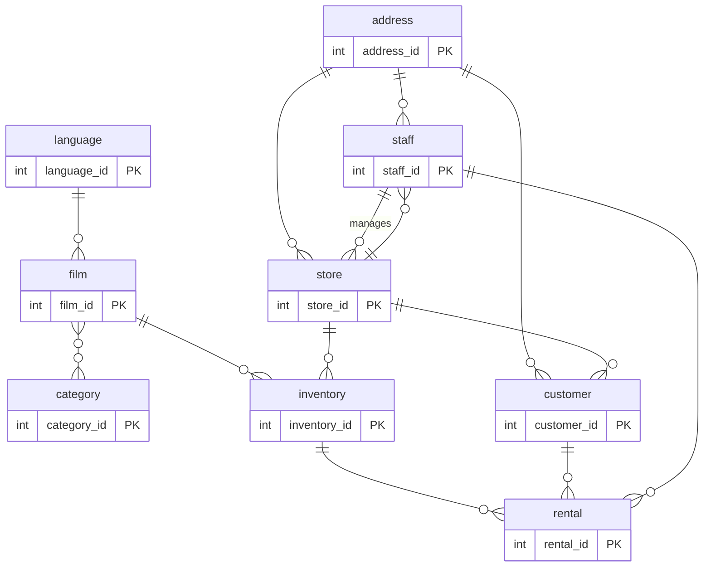

# Sakila Rental API

Backend REST for a movie rental system using Spring Boot, PostgreSQL, Sakila, Spring Security, JWT, BCrypt, Spring Data JPA, HikariCP and Swagger/OpenAPI.

This project does not include a functional web GUI. Validation and main usage are done via Swagger UI or HTTP clients like curl/Postman.

## Technologies

| Technology                    | Usage                                              |
| ----------------------------- | -------------------------------------------------- |
| Java 17.0.12 LTS              | Project runtime                                    |
| Spring Boot 4.1.0             | REST application development                       |
| Spring Web 4.1.0              | Controllers and HTTP endpoints                     |
| Spring Data JPA 4.1.0         | Persistence and PostgreSQL access                  |
| Spring Security 4.1.0         | Authentication and role-based authorization        |
| PostgreSQL 17.10              | Database engine                                    |
| PostgreSQL JDBC Driver 42.7.11| Connection between Spring Boot and PostgreSQL      |
| Sakila for PostgreSQL         | Rental system data model                           |
| HikariCP 7.0.2                | Database connection pool                           |
| BCrypt                        | Secure password hashing via Spring Security        |
| JWT / JJWT 0.12.6             | Authentication token generation and validation     |
| Springdoc OpenAPI 2.8.5       | OpenAPI documentation for the REST API             |
| Swagger Core 2.2.28           | Swagger documentation modeling and annotations     |
| Swagger UI 5.18.3             | Web interface to test endpoints                    |
| Maven 3.9.9                   | Dependency management, build and execution         |
| WAR                            | Application packaging                              |

## ER Diagram

Sakila model tables used by the API:



Additional `users` table (JWT authentication, not part of the original Sakila model).

## Requirements

- Java 17.
- Active PostgreSQL.
- `sakila` database.
- Maven Wrapper included in the project.

## Configuration

Create `.env` from the template:

```bash
cp .env.example .env
```

Expected values for local development:

```env
DB_HOST=localhost
DB_PORT=5432
DB_NAME=sakila
DB_USERNAME=brigitte
DB_PASSWORD=b74g1tt3

JWT_SECRET=a2V5c2FraWxhcmVudGFsMjAyNnNlZ3VyaWRhZGp3dGFhMA==
JWT_EXPIRATION=432000000

SERVER_PORT=8080
```

`run.sh` and `run.ps1` load `.env` before starting the application.

## Database

Run full setup:

```bash
sudo ./db/setup.sh
```

Or execute manually:

```bash
sudo -u postgres createdb sakila
sudo -u postgres psql -d sakila -f db/credentials.sql
sudo -u postgres psql -d sakila -f db/schema.sql
sudo -u postgres psql -d sakila -f db/seed.sql
sudo -u postgres psql -d sakila -f db/index.sql
```

The application automatically creates test users on startup if they do not exist.

## Run

Linux/macOS:

```bash
./run.sh
```

Windows PowerShell:

```powershell
.\run.ps1
```

Build WAR:

```bash
./mvnw -DskipTests package
```

## Swagger

Open:

```text
http://localhost:8080/swagger-ui/index.html
```

OpenAPI JSON:

```text
http://localhost:8080/v3/api-docs
```

## Test Users

| Role  | Username | Password    | Email              | Usage                                                |
| ----- | -------- | ----------- | ------------------ | ---------------------------------------------------- |
| ADMIN | `admin`  | `Admin123!` | `admin@sakila.app` | Administrative endpoints and authenticated endpoints |
| USER  | `user`   | `User123!`  | `user@sakila.app`  | Query, rental and history endpoints                  |

Notes:

- Passwords are stored with BCrypt, not in plain text.
- The `user` account has id `2`, aligned with `customer_id=2` from the Sakila seed for testing rentals.
- Users created via `/api/auth/register` receive role `USER`.

## API Usage Flow

### 1. Verify The App Responds

Swagger should return `200`:

```bash
curl -i http://localhost:8080/swagger-ui/index.html
```

### 2. Log In

ADMIN:

```bash
curl -X POST http://localhost:8080/api/auth/login \
  -H "Content-Type: application/json" \
  -d '{"username":"admin","password":"Admin123!"}'
```

USER:

```bash
curl -X POST http://localhost:8080/api/auth/login \
  -H "Content-Type: application/json" \
  -d '{"username":"user","password":"User123!"}'
```

The response returns:

```json
{
  "token": "...",
  "username": "user",
  "role": "USER"
}
```

### 3. Use The Token

Copy the token and send it on every protected endpoint:

```bash
curl http://localhost:8080/api/categories \
  -H "Authorization: Bearer <TOKEN>"
```

In Swagger:

1. Execute `/api/auth/login`.
2. Copy `token`.
3. Press `Authorize`.
4. Enter `Bearer <TOKEN>`.
5. Test protected endpoints.

## Public Endpoints

| Method | Endpoint                 | Auth | Body                                                                     |
| ------ | ------------------------ | ---- | ----------------------------------------------------------------------- |
| POST   | `/api/auth/login`        | No   | `{"username":"admin","password":"Admin123!"}`                           |
| POST   | `/api/auth/register`     | No   | `{"username":"new","email":"new@sakila.app","password":"User123!"}`     |
| GET    | `/swagger-ui/index.html` | No   | None                                                                    |
| GET    | `/v3/api-docs`           | No   | None                                                                    |

## Endpoints For ADMIN or USER

Require header:

```text
Authorization: Bearer <TOKEN>
```

| Method | Endpoint                          | Role          | Description                                |
| ------ | --------------------------------- | ------------- | ------------------------------------------ |
| GET    | `/api/categories`                 | ADMIN or USER | List categories                            |
| GET    | `/api/films`                      | ADMIN or USER | List films                                 |
| GET    | `/api/films/{id}`                 | ADMIN or USER | Get film by id                             |
| GET    | `/api/films/search?title=ACADEMY` | ADMIN or USER | Search films by title                      |
| GET    | `/api/rentals/my-active-rentals`  | ADMIN or USER | Active rentals for the authenticated user  |
| GET    | `/api/rentals/my-history`         | ADMIN or USER | Rental history for the authenticated user  |
| POST   | `/api/rentals/rent`               | ADMIN or USER | Rent a film                                |
| PUT    | `/api/rentals/return`             | ADMIN or USER | Return a rental                            |

Rental example:

```bash
curl -X POST http://localhost:8080/api/rentals/rent \
  -H "Content-Type: application/json" \
  -H "Authorization: Bearer <TOKEN_USER>" \
  -d '{"filmId":1,"staffId":1}'
```

Return example:

```bash
curl -X PUT http://localhost:8080/api/rentals/return \
  -H "Content-Type: application/json" \
  -H "Authorization: Bearer <TOKEN_USER>" \
  -d '{"rentalId":3}'
```

## ADMIN-Only Endpoints

Require the `admin` token.

| Method | Endpoint                        | Body                               | Description                        |
| ------ | ------------------------------- | ---------------------------------- | ---------------------------------- |
| POST   | `/api/admin/categories`         | `{"name":"Anime"}`                 | Create category                    |
| PUT    | `/api/admin/categories/{id}`    | `{"id":17,"name":"Anime Updated"}` | Update category                    |
| DELETE | `/api/admin/categories/{id}`    | None                               | Delete category if possible        |
| POST   | `/api/admin/films`              | See example below                  | Create film                        |
| PUT    | `/api/admin/films/{id}`         | See example below                  | Update film                        |
| DELETE | `/api/admin/films/{id}`         | None                               | Delete film if possible            |
| GET    | `/api/admin/inventory?filmId=1` | None                               | Query inventory by film            |
| POST   | `/api/admin/inventory`          | `{"filmId":1,"storeId":1}`         | Create inventory item              |
| DELETE | `/api/admin/inventory/{id}`     | None                               | Delete inventory item              |

Example for creating a film:

```json
{
  "title": "NEW TEST FILM",
  "description": "Demo film for API testing",
  "releaseYear": 2026,
  "rating": "PG",
  "rentalRate": 4.99,
  "length": 90,
  "language": "English"
}
```

## Quick Curl Tests

Login and categories:

```bash
TOKEN=$(curl -s -X POST http://localhost:8080/api/auth/login \
  -H "Content-Type: application/json" \
  -d '{"username":"user","password":"User123!"}' \
  | sed -n 's/.*"token":"\([^"]*\)".*/\1/p')

curl http://localhost:8080/api/categories \
  -H "Authorization: Bearer $TOKEN"
```

Admin login and create category:

```bash
ADMIN_TOKEN=$(curl -s -X POST http://localhost:8080/api/auth/login \
  -H "Content-Type: application/json" \
  -d '{"username":"admin","password":"Admin123!"}' \
  | sed -n 's/.*"token":"\([^"]*\)".*/\1/p')

curl -X POST http://localhost:8080/api/admin/categories \
  -H "Content-Type: application/json" \
  -H "Authorization: Bearer $ADMIN_TOKEN" \
  -d '{"name":"Anime"}'
```

## Security And Connection

- JWT HMAC-SHA256 with at least 256-bit Base64 secret.
- BCrypt strength 10.
- Role-based authorization with `ROLE_ADMIN` and `ROLE_USER`.
- HikariCP configured in `application.properties`.
- `spring.jpa.hibernate.ddl-auto=none`; schema is created with SQL scripts.
- Real credentials kept out of the repository via `.env`.
